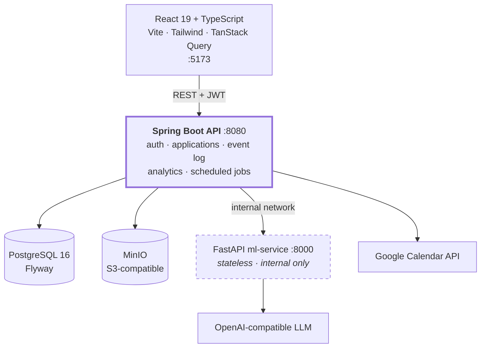

# JobTrail

A job application tracker where each application is a **train running along a transit line** —
stations are hiring stages, travelled track shows where you've been, and the live position
shows where you are now.

Built as a hybrid **Java + Python** system: a Spring Boot transactional core owning all state,
and a small stateless FastAPI service handling the one genuinely Python-only concern (LLM
extraction and embedding similarity).

<!-- Add once deployed: **[Live demo](https://…)** · -->
**[API docs (Swagger UI)](http://localhost:8080/swagger-ui.html)** (local) · **[Full API reference](docs/backend.md)**

---

## Why this exists

Analytics in most trackers read from a mutable `status` column, which means the moment an
application moves from `SCREEN` to `INTERVIEW`, the fact that it was ever in `SCREEN` is gone.
You can show a user where they are; you can't show them how they got there, how long it took,
or where they keep stalling.

JobTrail writes **every status change as an immutable row** in an append-only event log and
never overwrites anything. That one decision is what makes the funnel analytics, the
time-in-stage metrics, and the transit-map visualization possible — they're all just different
reads over the same log.

---

## Architecture



**The public surface is the Spring Boot API and nothing else.** The Python service is reachable
only from Java over the internal Docker network — it has no database, no auth of its own, and
every request to it is fully self-contained.

### Why split the services at all

The honest answer is that most of this app has no business being in Python, and the LLM/embedding
part has no business being in Java.

Sentence-transformers, the OpenAI SDK, and the scraping stack are Python-native; reimplementing
them on the JVM would mean fighting the ecosystem for no gain. But auth, transactions, ownership
enforcement, and schema migrations are exactly what Spring Boot is good at, and pushing those
into Python to avoid a second service would trade a clean boundary for a worse core.

So the split follows the actual constraint: **Java owns all state and all trust; Python owns one
stateless transformation.** Text in, structured data out. That boundary is narrow enough to
describe in a sentence, which is how you know it's in the right place.

### Failure paths are part of the design

The interesting question about a two-service system isn't how it works — it's what happens when
half of it is down. Every degradation here is deliberate:

| What breaks | What happens | Result |
|---|---|---|
| `ml-service` unreachable or slow | `JobPostingParseService` retries with backoff, then gives up | User falls back to **manual entry**. Core app fully functional. |
| No `OPENAI_API_KEY` | Service swaps in `StubLLMClient` — a deterministic regex + keyword-vocabulary extractor | Lower confidence scores, **never a hard failure** |
| No embedding model available | `MLSVC_EMBEDDING_BACKEND=hashing` uses a dependency-free hashed bag-of-words vectorizer | Match scoring still works — and CI runs on this, so tests need no model download and no network |
| Google Calendar not connected | Sync endpoint returns `409` | Every other interview-round feature unaffected |

Quality degrades. Availability doesn't.

---

## Features

**Core pipeline**
- Applications through `SAVED → APPLIED → SCREEN → INTERVIEW → FINAL → OFFER`, plus `REJECTED` / `GHOSTED` terminal states
- Append-only status event log — nothing is ever overwritten
- Transit-map view rendering each application's journey from that log (custom SVG)
- Interview rounds per application: type, interviewer, questions asked, notes, post-round reflection
- CSV export for both applications and interview rounds

**Analytics** (all derived from the event log)
- Conversion funnel — how many applications ever reached each stage
- Stage-to-stage conversion rates between adjacent pipeline steps
- Average days-in-stage
- Resume-version and source performance — which résumé and which channel actually get responses

**AI features** (the FastAPI service)
- Paste a job URL → scrape → LLM extracts company, role, salary, and required skills into a strict Pydantic schema, with a confidence score
- Résumé → structured profile extraction (skills, years of experience, past roles, seniority)
- Résumé ↔ JD match score via embedding similarity, with an explicit **matched / missing skills** gap list

**Platform**
- Stateless JWT auth with refresh-token rotation (the presented token is revoked, a new pair issued) and bcrypt hashing
- Sign in with Google / GitHub
- Two-way Google Calendar sync for interview rounds — idempotent by stored `googleEventId`, so re-syncing updates rather than duplicates
- Résumé / cover-letter versioned storage in MinIO with presigned download URLs and Apache Tika text extraction
- Cron-scheduled background jobs: deadline reminder emails and stale-application auto-ghosting

---

## Tech stack

| Layer | Stack |
|---|---|
| **Backend** | Java 21, Spring Boot 4, Spring Security 6, Spring Data JPA / Hibernate, Flyway, JJWT, MapStruct, Lombok, Apache Tika, springdoc-openapi |
| **ML service** | Python 3.11, FastAPI, Pydantic v2, sentence-transformers, OpenAI SDK, httpx + BeautifulSoup |
| **Frontend** | React 19, TypeScript, Vite, Tailwind CSS 4, TanStack Query, React Router |
| **Data** | PostgreSQL 16, MinIO (S3-compatible) |
| **Infra** | Docker Compose, GitHub Actions, JaCoCo |
| **Testing** | JUnit 5, Mockito, Testcontainers, pytest, respx |

---

## Testing

**167 automated tests** — 118 JUnit 5 / Mockito on the backend, 49 pytest on the ML service.

The integration tests run against **real infrastructure, not mocks or H2**: 15 test classes spin
up genuine PostgreSQL and MinIO containers via Testcontainers. This catches what an in-memory
substitute can't — actual Flyway migrations applying in order against real Postgres, real
constraint and cascade behaviour, real presigned-URL generation.

Both CI workflows run on every push. `ubuntu-latest` ships a running Docker daemon, which is all
Testcontainers needs, so the same integration tests that run on a laptop run unchanged in CI.
JaCoCo coverage and surefire reports are uploaded as build artifacts.

```bash
cd backend && ./mvnw verify      # backend, incl. Testcontainers integration tests
cd ml-service && pytest          # ML service
```

---

## Running locally

**Prerequisites:** JDK 21, Node 20+, Python 3.11+, Docker.

**1. Start the infrastructure** — Postgres, MinIO, Mailpit, and the ML service container:

```bash
cd backend
cp .env.example .env          # every var has a working dev default
docker compose up -d
```

**2. Run the API** — Flyway applies all 12 migrations on first boot:

```bash
./mvnw spring-boot:run         # → http://localhost:8080
```

**3. Run the frontend:**

```bash
cd frontend
npm install
npm run dev                    # → http://localhost:5173 (Vite proxies /api to :8080)
```

The app is fully usable at this point with **no API keys of any kind** — job parsing falls back
to the heuristic extractor, and everything else works normally. To enable real LLM extraction,
set `MLSVC_OPENAI_API_KEY` in `backend/.env` (an OpenAI key, or a Gemini key plus
`MLSVC_OPENAI_BASE_URL` pointed at Google's OpenAI-compatible endpoint).

### Local dev endpoints

| Service | URL | Notes |
|---|---|---|
| Frontend | http://localhost:5173 | |
| API | http://localhost:8080 | Swagger UI at `/swagger-ui.html` |
| ML service | http://localhost:8000 | `/docs` for its own Swagger UI |
| Mailpit | http://localhost:8025 | Catches every reminder email — nothing is really sent |
| MinIO console | http://localhost:9001 | |
| pgAdmin | http://localhost:5050 | |

Every configurable value is documented in `backend/.env.example`, `frontend/.env.example`, and
`ml-service/.env.example`.

---

## API

36 REST endpoints across 8 controllers. Everything except signup, login, OAuth, refresh, and
logout requires `Authorization: Bearer <accessToken>` and is scoped to the authenticated caller —
**ownership is enforced at the repository lookup, not just the controller**, so there's no path
that returns another user's data.

| Group | Base path | |
|---|---|---|
| Auth | `/api/auth` | Signup, login, OAuth, refresh rotation, logout, whoami |
| Applications | `/api/applications` | CRUD, stage transitions, status history, CSV export, match scoring |
| Interview rounds | `/api/applications/{id}/interviews`, `/api/interviews` | CRUD, calendar sync, CSV export |
| Documents | `/api/documents` | Versioned résumé / cover-letter upload, presigned download |
| Analytics | `/api/analytics` | Funnel, conversion, time-in-stage, resume performance |
| Résumé profile | `/api/resume-profile` | Parse latest résumé into a structured profile |
| Job parsing | `/api/job-postings` | URL / text → structured posting |
| Calendar | `/api/google-calendar` | OAuth connect, status, disconnect |

Full reference with request/response shapes, validation rules, and error codes:
**[`docs/backend.md`](docs/backend.md)**.

Errors are uniform across every endpoint:

```json
{ "timestamp": "...", "status": 404, "error": "Not Found", "message": "...", "path": "/api/..." }
```

---

## Explicitly out of scope

Knowing what to cut matters as much as what to build:

- **Auto-apply to jobs** — nobody actually wants it, and it gets you rate-limited
- **Large-scale job-board scraping** — legal grey zone, and a different product
- **A mobile app** — scope creep
- **Multi-tenancy / real-time collaboration** — no user need at this stage
- **A recommendation engine** — not enough data for it to mean anything

---

## Project layout

```
backend/          Spring Boot API — analytics, application, auth, document,
                  googlecalendar, interview, jobposting, matching,
                  notification, scheduler, status, user
frontend/         React + TypeScript SPA, feature-sliced
ml-service/       FastAPI parse & match service (stateless)
docs/             Project overview and full API reference
```

---

## Roadmap

- [ ] Public deployment with a live demo URL
- [ ] Redis-backed caching for analytics reads (Redis is in the compose file but not yet wired into the app)
- [ ] Write-up on the event-log design and what it made possible
